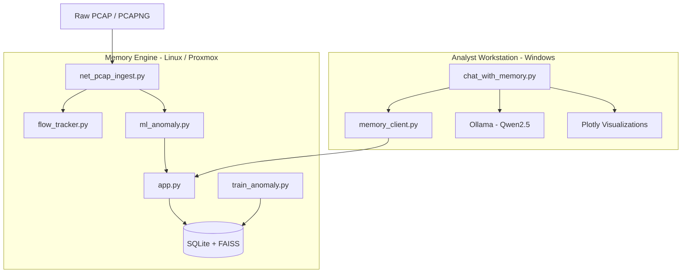

# 🛡️ Project Sairene: AI-Driven Network Forensic Analysis

## 📒 Overview

**Project Sairene** is a distributed network forensic framework designed to identify stealthy cyberattacks in resource-constrained environments. By combining **Isolation Forest** statistical modeling with a **Heuristic Behavioral Override**, Sairene identifies "Low-and-Slow" exfiltration patterns and stealth scans that typically evade standard detection thresholds.

It combines:

-  **Isolation Forest anomaly detection**
-  **Heuristic Behavioral Overrides**
-  **Retrieval-Augmented Generation (RAG)**
-  **LLM-powered plain-English threat analysis**

Sairene specializes in identifying:

- Low-and-Slow Data Exfiltration  
- Stealth Reconnaissance Scans  
- Beaconing / Callback Malware Traffic  
- Suspicious Flows Hidden Below Threshold Alerts

---

## 🧬 Core Philosophy

- Detect what blends in.  
- Explain what machines ignore.  
- Surface what attackers hide.

---

## 🏗️ Architecture

## 📂 Components

### 🧠 Server Side

| File                 | Purpose                                   |
| -------------------- | ----------------------------------------- |
| `app.py`             | FastAPI service, FAISS memory, SQLite API |
| `net_pcap_ingest.py` | Batch packet parser using Scapy           |
| `flow_tracker.py`    | Bidirectional conversation tracker        |
| `l2_tracker.py`      | Heuristic driven and confidence score detection        |
| `ml_anomaly.py`      | Hybrid anomaly detection engine           |
| `train_anomaly.py`   | Offline model retraining                  |

### 👁️ Client Side

| File                  | Purpose                     |
| --------------------- | --------------------------- |
| `chat_with_memory.py` | Main analyst CLI            |
| `memory_client.py`    | HTTP bridge to server       |
| `sysinfo.py`          | Hardware / telemetry module |
| `animation.py`        | Startup UX / persona layer  |

## 🔍 Detection Methodology

**Hybrid Detection Gate**

Sairene uses a three-pass scoring model:

***Pass 1: Statistical Detection***

**Isolation Forest evaluates a 20-feature vector including:**

- Flow duration
- Byte ratios
- Port rarity
- Packet cadence
- Burst patterns

The 1st Pass can detect attacks that have evidence from single packet analysis. For example a XMAS attack and the unusual flag (FIN + PSH + URG combination does not appear in a usual traffic)

***Pass 2: Behavioral Override***

**Rules specifically target:**

*Low-and-Slow Exfiltration:*
- Duration > 30 seconds
- Bitrate < 5000 bps
- Non-standard ports
- Sustained outbound leakage
  
*Stealth Recon:*
- Sparse probing
- Sequential host touches
- Delayed packet cadence
- Low-noise scanning behavior

  
   
  <i>netask Pass 2 example | Low and Slow Exfiltration Attack</i>

  
   
  <i>netviz anom Pass 2 example | Low and Slow Exfiltration Attack</i>

***Pass 3: Layer 2 Behavioral Summaries***

Pass 3 analyzes traffic that cannot be represented reliably as normal IP flows.  
While Pass 2 groups packets into L3/L4 flows, many infrastructure-level attacks happen at Layer 2 and do not follow TCP/UDP flow semantics.

During this pass, Sairene uses dedicated L2 trackers to aggregate behavior over time and emit `l2_summary` records. These summaries represent incident-level evidence for attacks such as:

- ARP Poisoning
- Gratuitous ARP Storms
- DHCP Starvation
- MAC Flooding
- STP Root Bridge Attacks
- VLAN Hopping / Double-Tagging

  
   
  <i>netask Passs 3 example | STP Root Bridge Attack</i>

  
   
  <i>netviz anom Pass 3 example | STP Root Bridge Attack</i>

## ⏱️ Bidirectional IAT Tracking

Unlike standard sniffers, Sairene removes ACK-only timing distortion.

This enables accurate detection of:

- Beacon intervals
- Malware sleep-jitter callbacks
- Automated schedulers
- Fake background service traffic

## 💻 Commands

| Command             | Function                |
| ------------------- | ----------------------- |
| `/netimport <file>` | Import PCAP capture     |
| `/netask <query>`   | Query memory with RAG   |
| `/netviz --anom`    | Anomaly timeline        |
| `/netviz --flow`    | Traffic Sankey diagram  |
| `/netviz --top-ips` | Top IP chart            |
| `/netstats`         | Capture summary         |
| `/neofetch`         | Client/server telemetry |

## 🚀 Why Sairene Matters

Traditional IDS systems detect loud attacks.

Modern attackers stay quiet.

Sairene focuses on:

- Subtle behavioral anomalies
- Statistical rarity
- Human-readable explanations
- Lightweight deployment
- Distributed investigation workflows

🛡️ Sairene

Silent Detection for Quiet Threats.

